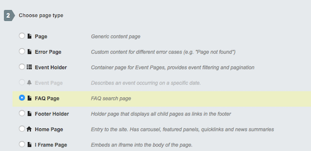
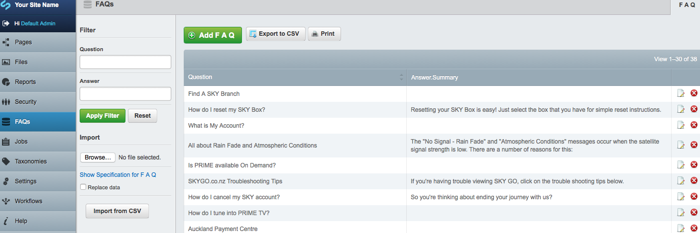
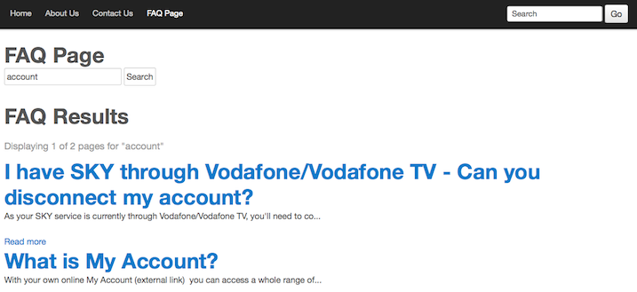
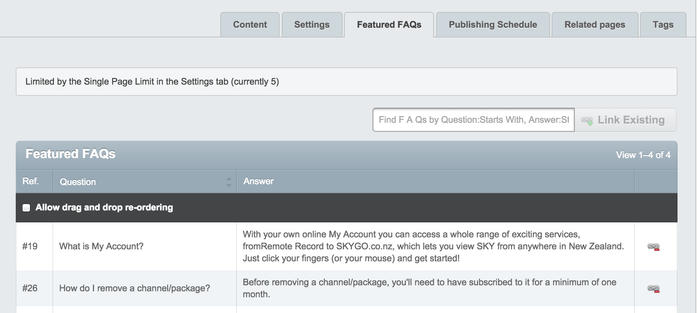
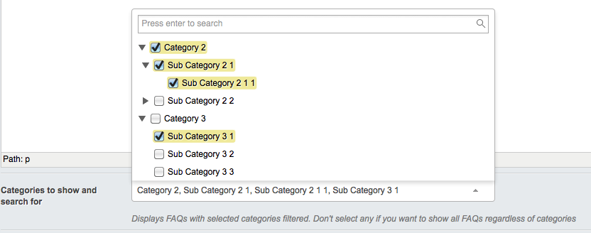

# FAQ

## Introduction

This module provides FAQ functionality on top of Solr.

Just by adding the module to the project, you'll get a ModelAdmin for FAQs, where you can manage Questions & Answers.
You only need to add an FAQPage type (comes with the module), and some questions and answers. Remember to do `Solr_Configure` and `Solr_ReIndex`.

The module comes with its own Solr search index, customized to have a fuzzy search, and has its own file for stopwords and synonyms.

## Requirements

 * [Fulltextsearch module](https://github.com/silverstripe-labs/silverstripe-fulltextsearch), v2.1.0 or up.

## Installation

Edit your project-wide composer.json file as follows; in the "require" block add:

    "silverstripe/faq": "*"

Then in the root of your project run:

    #> composer update silverstripe/faq

Or just

    composer install silverstripe/faq

Run a database rebuild by visiting *http://yoursite.com/dev/build*. This will add the required database
columns and tables for the module to function.


### Configuring Solr
The module assumes you already have Solr installed and configured. If using CWP, then it will be configured for you.
We assume that if you are using this module, you already have Solr configured and running, but if you need help getting started with configuration,
here is some starting code for configuring Solr

````
/**
 * Configure Solr.
 */
if(!class_exists('Solr')) return;

// get options from configuration
$options = Config::inst()->get('CwpSolr', 'options');
$solrOptions = array(
			'host' => defined('SOLR_SERVER') ? SOLR_SERVER : 'localhost',
			'port' => defined('SOLR_PORT') ? SOLR_PORT : 8983,
			'path' => defined('SOLR_PATH') ? SOLR_PATH : '/solr/',
			'version' => 4,

			'indexstore' => array(
				'mode' => defined('SOLR_MODE') ? SOLR_MODE : 'file',
				'auth' => defined('SOLR_AUTH') ? SOLR_AUTH : NULL,

				// Allow storing the solr index and config data in an arbitrary location,
				// e.g. outside of the webroot
				'path' => defined('SOLR_INDEXSTORE_PATH') ? SOLR_INDEXSTORE_PATH : BASE_PATH . '/.solr',
				'remotepath' => defined('SOLR_REMOTE_PATH') ? SOLR_REMOTE_PATH : null
			)
		);

Solr::configure_server($solrOptions);
````


This code would go on `mysite/_config.php`.

### Using CWP

If your using the module with CWP, extra requirements should be noticed (even if not required on composer for this project)

 * CWP 1.1.1
 * CWP-core 1.1.2

Also notice that some custom search configurations from CWP don't apply to FAQs out of the box. Manual configuration will need to be applied to make it resemble CWP conf. There's a `cwp-version` tag that doesn't require any other configuration, but will not get future updates.


## Quickstart

1. Add a FAQPage to your CMS

    

2. Add an FAQ on the FAQ ModelAdmin sidebar link

    

3. Wait for Solr to reindex
4. Search your FAQ page :)

    

## Configuration

### Frontend templates

All templates can be overloaded from within your project themes directory. Module default templates can be found in the module's `templates` directory.

### Configuration using YAML

FAQ module comes with a default set of templates to start the Solr index. If you want to override the path from where this files
come from, you need to add a YAML file like this.
```
---
Name: faqoverride
After: 'faq/*'
---
FAQSearchIndex:
  options:
    extraspath: 'new/path/to/extrapath'
    templatespath: 'new/path/to/template'

FAQ:
  question_boost: '3'
  answer_boost: '1'
  keywords_boost: '4'
```
### Adding Featured FAQs

Featured FAQs appear on the FAQ Page before a user performs a search. These can be added and organised from the `Featured FAQs` tab of the FAQ Page CMS admin.



### Categorizing

The FAQ module gives the option to categorize each FAQ and filter the results fetched on search. You only need to
create some Taxonomies for the categories and assign categories to the FAQs. Then filter them in the FAQPage.



This way the FAQPage will show a dropdown on the frontend to filter by categories.
If the FAQPage doesn't have any category selected, it will display all FAQs.

#### Search logging

FAQ searches performed on the FAQ page are logged so that a record is kept of the search term used and the results pages and FAQ articles that were viewed as a result of the search. There is also functionality to rate and leave a comment about an FAQ article.

All of this search data is available in the CMS in the "Search Log" section. CMS users can filter the data on numerous criteria and drill into results to find and rectify gaps in the knowledge base.

There are convenient links through to FAQ articles for content authors to amend the content and keywords for an article in order to boost the article higher in search results for appropriate search terms.

To connect all of this data together a session ID is associated with each record along with a search log ID passed as a GET param. This helps to prevent the data integrity being corrupted when URLs are shared between browsers and sessions. Further description of the functionality is described in the FAQ search logging unit test.

## TODO

- Get static config variables from yml files for controller
- Pagetypes, search index and dataobjects easily extendable
- cwp manual configuration if not using `cwp-version`
- make this a supported SS module
- Better appraoch for archiving search logs and related data
