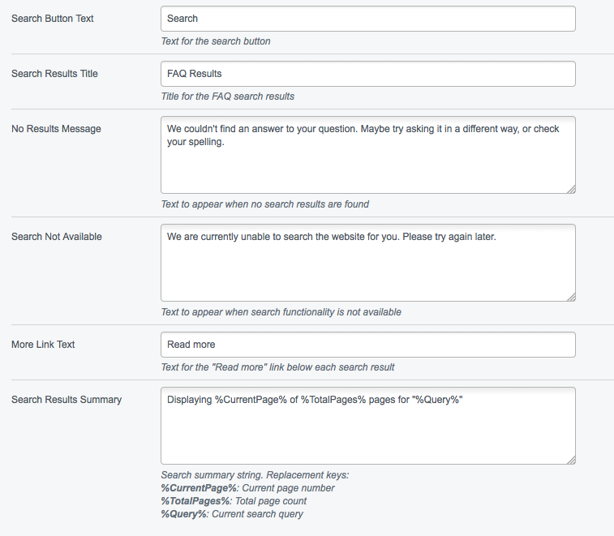

# Configuration

## YAML

FAQ module comes with a default set of templates to start the Solr index. If you want to override the path from where this files
come from, you need to add a YAML file like this.

```
---
Name: faqoverride
After: 'faq/*'
---
FAQSearchIndex:
  options:
    extraspath: 'new/path/to/extrapath'
    templatespath: 'new/path/to/template'

FAQ:
  question_boost: '3'
  answer_boost: '1'
  keywords_boost: '4'
```

See `FAQPage_Controller` to check more configurations available.

## CMS

On `FAQPage` there's a lot of text configurations available. All come with default text.




## Frontend templates

All templates can be overloaded from within your project themes directory. Module default templates can be found in the module's `templates` directory.
